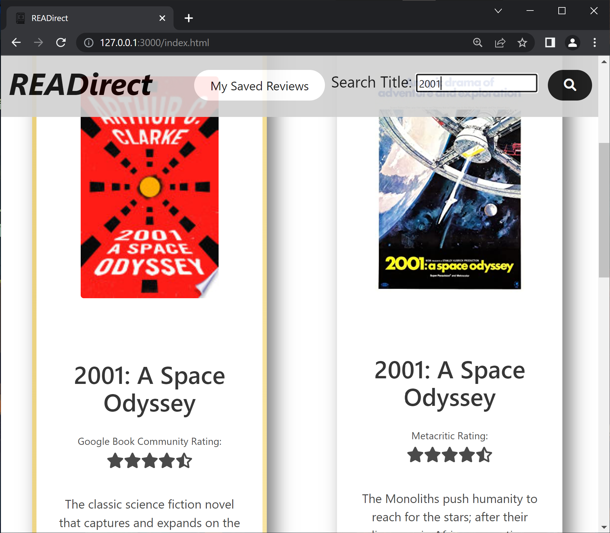

# READirect

## Description

- READirect is an application that pulls reviews on books that are also movies from server-side web APIs for easier comparison.
- This application created by the collaborative efforts of Katie, Ryan, Moshe and Fumi to gain experience working with new technology in a professional team environment. This project also allowed all participants to reinforce their existing HTML, CSS, JavaScript and jQuery skillsets.
- READirect was designed to accomodate users in a pinch for time, seeking advice on whether the book or movie version of a story will be most worthwhile. To address these needs, our application presents movie and book review data side by side, highlights the medium with the higher overall reviews and allows users to save reviews for later use. 

### Built with

- Bulma
- jQuery

## APIs

- Google Books
- Move Database Alternative (IMDb-based)

### Contributors

- [Moshe](https://github.com/Moshe-jpg)
- [Fumi](https://github.com/fumixer)
- [Ryan](https://github.com/ryanraposo)
- [Katie](https://github.com/katiebutler37)

### Page Preview

 

### Link to Application

[View in browser](https://katiebutler37.github.io/readirect/)
